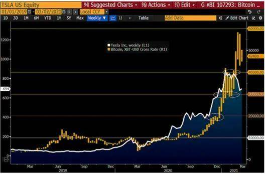
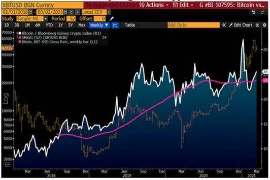
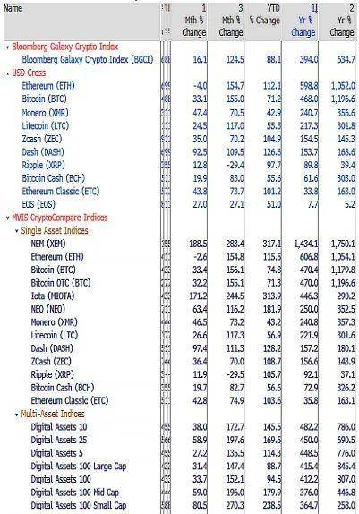
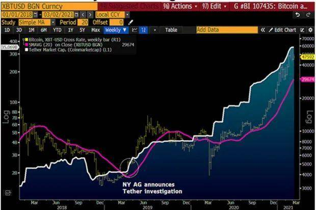
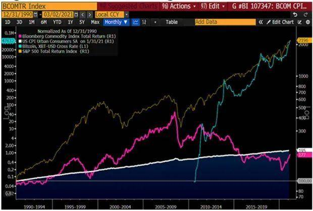
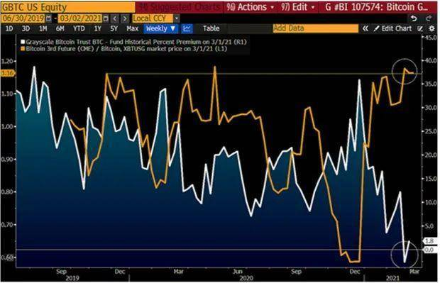
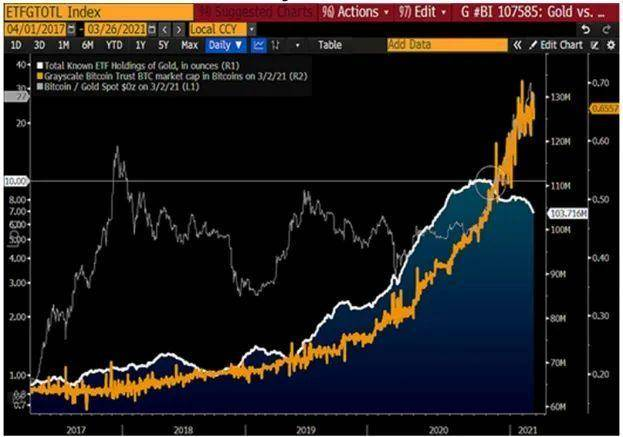
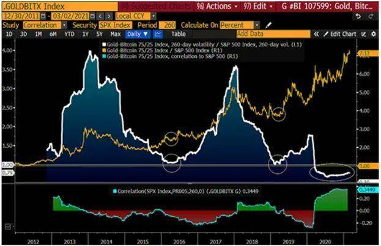
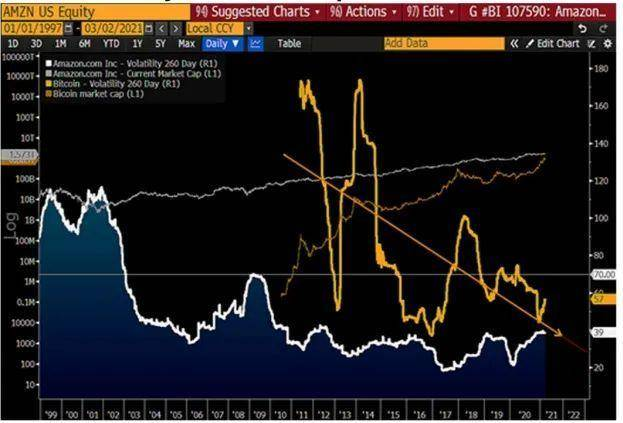

_撰文：Mike McGlone，Bloomberg Intelligence 高级商品分析师_
_编译：Moni，Odaily 星球日报_

Bloomberg Intelligence 近日发布了 2021 年 3 月的《彭博加密展望》（Bloomberg Crypto Outlook）报告

### 比特币 vs. 黄金、股票：别无选择

Bloomberg Intelligence——我们认为，到 2021 年，比特币将从投机风险资产转变为全球数字价值存储，比特币是全世界第一个诞生的加密货币，它引发了全球区块链和货币数字化革命。通过稳定币，美元作为全球储备货币的主导地位也得到增强，许多人认为比特币是对美元的补充，而且正在取代「旧的」储备资产——黄金。我们还认为，比特币正在经历价格发现过程，审慎的多元化特征将让比特币维持上升趋势。

现实情况是，资金正在从黄金、债券和股票流向比特币，特斯拉——按市值计算是全球最大的汽车制造商——已经将部分资金分配给了比特币，这无疑是一个最典型的例子。

### 比特币价格巩固在 40,000-60,000 美元区间

比特币价格会在 40,000-60,000 美元区间得到进一步巩固，并实现 60/40 混合迁移（Mix Migration）。二月份，比特币价格一度逼近 60,000 美元，但我们发现比特币可能在 40,000 美元足有找到相应的买家。需求增加和供应减少导致比特币价格会在 2021 年大幅上涨，预计会在 10,000 美元后面「加个零」。

下图：特斯拉股价和比特币价格走势对比——2021 年会是潜在拐点吗？
_
100,000 美元可能是比特币的下一个价格门槛。在价格发现过程中，比特币正变得越来越成熟，但我们看到上升趋势中看到需求增加、供应减少和宏观经济环境日益有利的情况，简单分析可以得出，比特币将保持自己的步伐。达到 2021 年的初始门槛略高于 50,000 美元和 1 万亿美元的市值后，比特币已经准备好稳定一段时间，其中 40,000 美元是初始回撤的支撑位。根据图表分析，比特币又一次向传统标准 60/40 投资组合进行了实质性迭代：二月份，按市值计算全球最大汽车制造商特斯拉已经将部分财富分配给了新生的数字储备资产。

截至 2021 年 3 月 2 日，比特币已上涨约 60％，而特斯拉股价在 2021 年基本未变。到年底，两者之间的差距似乎倾向于进一步扩大。

储备资产比特币 vs. 大量投机。比特币是第一个诞生的加密货币，这一独特属性正在推动其发展成为全球数字储备资产，同时也将比特币和其他 8,000 多种加密资产区分开来。从 Bloomberg Galaxy Crypto Index （BGCI）指数趋势图表中可以看出，比特币表现好过传统市场，由于比特币支持者越来越多，该指数可能会进一步升值。

下图：比特币仍是加密货币市场的主要引擎。

在预期范围内，加密资产监管可能会进一步加强，尤其是对美元稳定币的监管。美国证券交易委员会（SEC）在去年 12 月对 Ripple Labs （即 XRP 代币）采取了执法行动，表明了某些加密市场面临的风险，但同时也反映比特币优势正在进一步加强。

### 比特币储备资产，以太坊和金融科技

Bitcoin、DeFi 和多数投机过量 . 以一年期回报数据分析，比特币显示出更持久的潜力。另一方面，就像互联网的出现一样，我们看到以太坊在金融科技、非同质化代币（NFT）、去中心化交易所（DEX）和去中心化金融（DeFi）革命中处于最前沿，但在市值上，以太坊不太可能成为全球数字储备资产。比特币正朝着数字储备资产「最终局面」不断发展，也是股票和债券的替代投资方案。

此外，过去投资黄金的资金正不断向比特币倾斜。但是好的加密货币数量依然不多，Coinmarketcap 上约有 8,500 个可交易的加密货币资产，而一年前则接近 5,000 个，这表明加密市场投机性仍然较大。

加密货币浪潮中的数字美元需求旺盛。Tether 市值不断增加表明，市场需要美元的数字版本，也表明加密资产正处于上升趋势，上一次比特币和加密货币市场的关键拐点发生在 2019 年 4 月，当时纽约总检察长办公室宣布对 Tether 进行调查，但是经过短暂波动之后，稳定币又恢复元气，也保持了与美元的 1:1 挂钩，同时 Tether 市值和交易额也开始呈现上涨趋势。自那时开始，我们就一直看涨比特币。

### Tether 确保比特币成为数字黄金的货币

作为全球最大的稳定币，Tether 市值和交易量增长了约 10 倍。美国监管机构建议接受数字货币-特别是美元，如果 Tether 面临更多审查，无疑还会进一步提高比特币价值，这不是任何人的责任。

先进技术推动比特币 vs. 商品竞争。在过去的三十年中，大部分时间都没有让大宗商品投资者「捞到好处」，由于电气化、脱碳和数字化发展加快，我们认为如今市场基本面开始看好比特币。这种「数字黄金」正在取代传统贵金属黄金，因为挖掘黄金会加大对化石燃料的需求。

下图：数字储备资产 vs. 滚动期货。

虽然科技公司一些不利因素正在不断加剧，商品期货价格也出现波动，但科技公司应该会继续提高标准普尔 500 指数。与商品不同，当股市表现不佳时，比特币可能成为主要受益者。

### 崛起的比特币浪潮和 GBTC

灰度比特币信托基金 Grayscale Bitcoin Trust 出现折价销售，这意味着三月份比特币价格很可能会达到 100,000 美元。如果参考历史数据，会发现灰度比特币信托基金在二月份的折价幅度很高，这也给比特币市场提供了坚实的价格基础。另一方面，2020 年 12 月芝商所比特币期货交易价格收高约 20%。

根据 Bloomberg Intelligence 分析，灰度比特币信托基金在二月份以 2.7% 的折价率收盘。这里最近的一个例子发生在 2017 年 3 月，当时比特币价格大约是 1,000 美元，但在 2017 年 12 月飙升到近 20,000 美元。目前灰度比特币信托基金持有的比特币占到比特币总市值的 4%，而在 2017 年这一比例数字只有 1%，因此现在灰度比特币信托基金折价效应对市场的影响力更大。

### 灰度比特币信托基金恐慌抛售和比特币探底

灰度比特币信托基金溢价的急剧下降通常标志着比特币探底。在加拿大发行比特币交易所交易基金之后，美国开放比特币交易所交易基金的可能性越来越高，这给信托价格增加了压力，但 Bloomberg Intelligence 认为维持上升的趋势是更可能的结果。

套利者的喜悦——比特币 GBTC 与期货。在 2 月结束时，灰度比特币信托基金与 2020 年 12 月芝商所交易的期货的极端价格差异约为 20％，我们认为这是对比特币来说是个好事。下图描绘了灰度比特币信托基金以有史以来最大的折扣与滚动期货并存的比特币基础价格并置情况。以这样的折扣购买 GBTC，表示比特币实际价格应该接近 43,000 美元，而 2020 年 12 月的芝商所期货结算价为 53,250 美元。费用和滑点会弥补实际 20％ 的差距，但对于比特币长期投资者来说，显然可以简单地对冲部分期货持有量并锁定利润。

下图：灰度比特币信托基金折扣 vs. 期货溢价。

正常的成熟度和不断扩大的市场深度将缩小广泛的价格差异，我们认为 2021 年 2 月底的极端情况表明比特币仍处于上升状态。

### 比特币正在取代黄金

比特币正在取代黄金——或许只是一个时间问题了。对投资者来说，在自己的投资组合中用比特币取代黄金的速度越来越快。2020 年，比特币波动性不断下降，而其他大多数资产波动性则在加剧。比特币获得了「合法性」，当进入到 2021 年之后，我们看不到有什么可以阻挡比特币取代「守旧的」黄金。

下图：对于没有分配比特币资产的人，面临风险可能更大？

长期看比特币和黄金风险都不高。资金正在从黄金流出，而流入比特币的资金正在变多，我们没有足够的理由扭转这一趋势。比特币正在成为全球储备资产，其价格与黄金价格比例已经突破 10 倍，而且正朝着 100 倍的方向前进。

在不受价格影响的情况下，我们认为比特币采用率的上升趋势是审慎的，特别是对于历史上的黄金分配者而言，在快速数字化的世界中，黄金似乎变得冗余，这种风险正在加剧。

黄金、比特币优势：相对波动率较低。相比于黄金，比特币的表现依然更出色，而且风险也比标准普尔 500 指数低。Bloomberg Intelligence 分析显示，Gold-Bitcoin 75/25 Index 指数的 260 天波动率已经达到最低水平，而且和标准普尔 500 指数的相同风险衡量指标相比还低了 20%，类似的情况在 2016 年初时也出现过。自 2008 年开始到 2011 年底，Gold-Bitcoin 75/25 Index 指数上涨了 7 倍，而标准普尔 500 指数只增长了 1 倍。

下图：Gold-Bitcoin Index 波动性比标准普尔 500 指数更低。

通常来看，比特币与股票市场的 260 天相关性指标通常为负，但在三月初达到了 0.34，这是迄今为止的最高值。随着美联储推出货币量化宽松政策来推动 GDP 上升，预计 Gold-Bitcoin Index 指数价格会得到更持久的支撑。

### 比特币波动性正在下降

Bloomberg Intelligence 认为，一旦比特币在具有更大市场深度的新门槛下安定下来（可能接近 100,000 美元），波动性就会下降。

Amazon.com 和比特币——互联网兄弟。Bloomberg Intelligence 认为，如果传统评估模式延续的话，几年内比特币的年度波动性将好于 Amazon.com 公司股价。按照分析，比特币 260 天风险度量值大约为 60％，而使用互联网衡量世界上主要的商品卖方的相同度量值则为 40％。到 2022 年，比特币的波动性回归线有望好过 Amazon.com 公司。要知道，在 Amazon.com 公司公开交易的最初几年中，其波动性平均超过 100％。

下图：Bitcoin 波动性将会好于 Amazon 公司股价。

比特币挖矿时间表是固定不变的，这与大多数不确定供应和需求的资产和市场有所不同。比特币是一种基于互联网的创新技术，我们看不到有什么可以阻挡比特币成为全球数字价值存储，其市值也保持上升的趋势，甚至有可能超过 Amazon 公司。

免责声明：作为信息平台，本站所发布文章仅代表作者个人观点，与本站立场无关。文章内的信息、意见等均仅供参考，并非作为或被视为实际投资建议。
