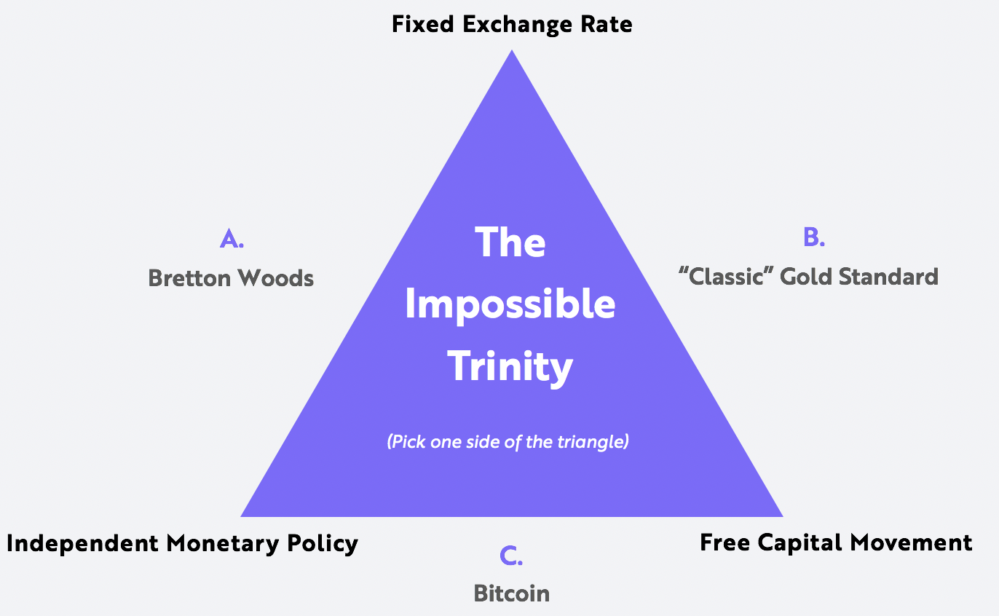
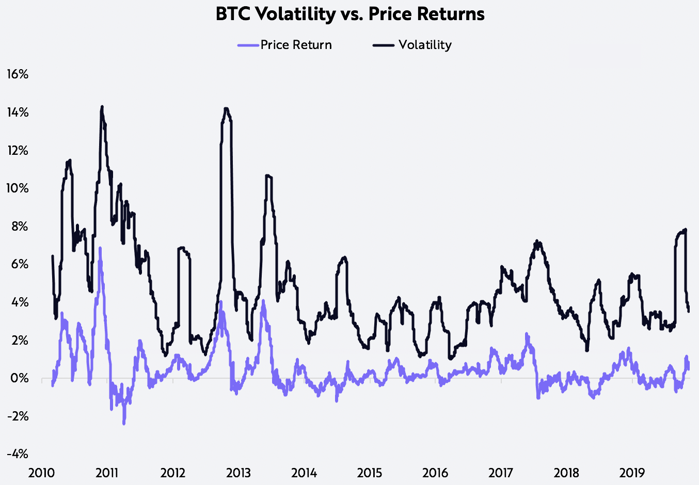
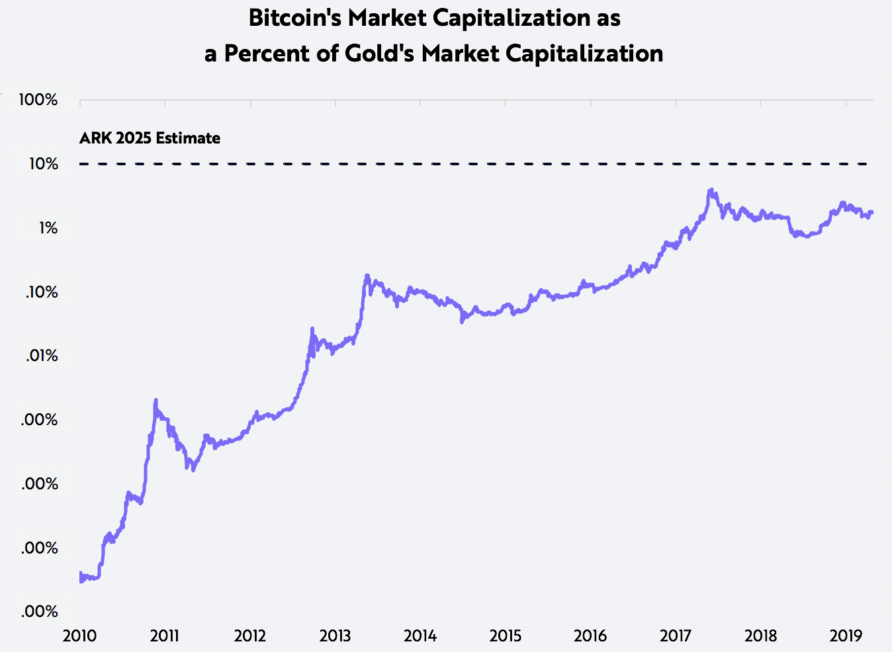
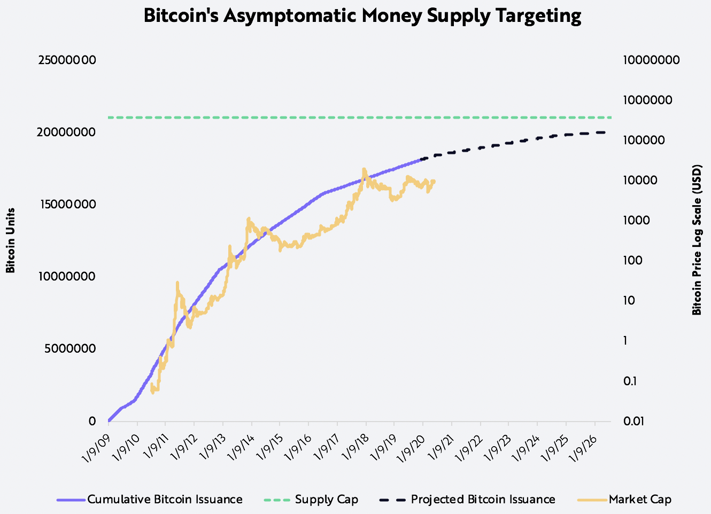
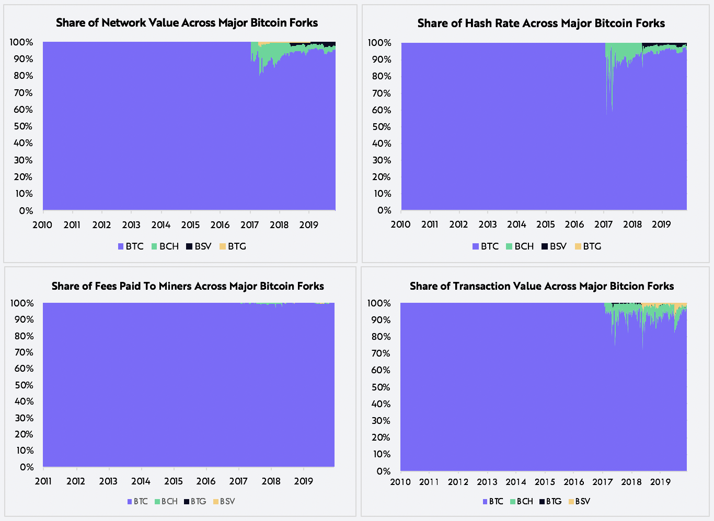
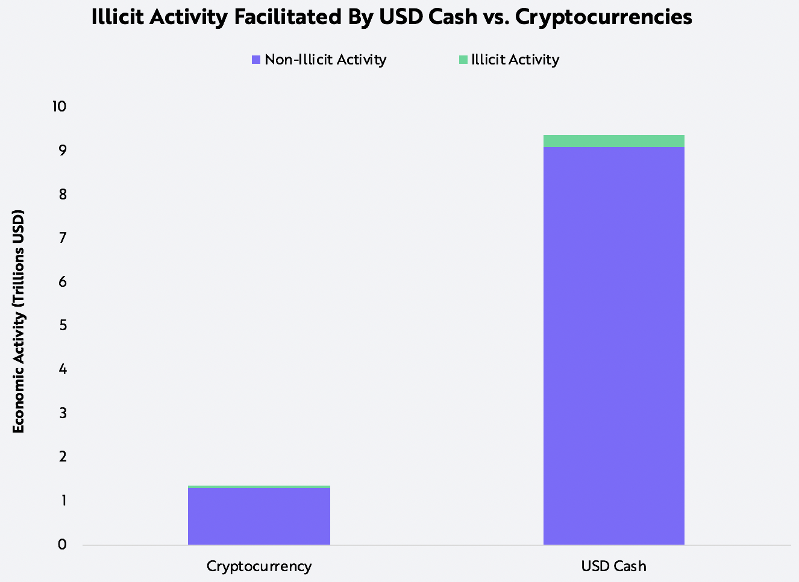

_撰文：Yassine Elmandjra, ARK invest（方舟投资）分析师_
_编译：Trendfund Research_

比特币自创立以来已超过11年，正努力获得广泛的机构认可。尽管建设性的批评是健康的，但ARK认为，一些有影响力的金融研究机构正在根据陈旧的信息，前后不一致的论点和有缺陷的分析来驳斥比特币。

鉴于高盛（Goldman Sachs）最近对比特币的立场，ARK正在重新审视对其接受有重大影响的误解。我们期待参与有关比特币的健康和教育性辩论，以及我们认为比特币在多元化投资组合中应发挥的重要作用。

### 声称: 比特币太不稳定，不能作为价值储备。
Claim: bitcoin is too volatile to serve as a store of value.
### 反诉: 比特币的波动性凸显了其货币政策的可信度。
Counter-Claim: bitcoin’s volatility highlights the credibility of its monetary policy.

批评者经常指出，比特币的波动性是“价值存储交易破坏者”。为什么有人会希望将资产的价格存储在每日价格如此剧烈的波动中？

我们认为，这些批评家不理解为什么比特币会波动，为什么比特币的波动性可能会降低。

比特币的波动性虽然分散了反对者评估其作为价值储存者的作用的注意力，但实际上却突显了其货币政策的信誉。不可能的三位一体是宏观经济政策的两难选择。如下图所示，三难困境假设，制定货币目标时，决策者可以满足三个目标中的两个，而不是三个，因为第三个目标与前两个目标中的一个相反。
__
Source: ARK Investment Management LLC, 2020

三难三角形的每一侧都是彼此排斥的。例如，选择固定汇率并允许资本自由流动的货币当局无法控制货币供应量的增长。同样，选择固定汇率和控制货币的货币当局不能容纳资本的自由流动，而选择容纳资本的自由流动并控制货币供应的选择不能确定汇率。

基于三难困境，我们可以理解为什么波动是比特币货币政策的自然结果。与现代中央银行相反，它没有优先考虑汇率稳定性。相反，基于货币的数量规则，比特币限制了货币供应量的增长，并允许资本的自由流动，放弃了稳定的汇率。结果，比特币的价格是需求相对于其供应的函数。它的波动性不足为奇。

也就是说，随着时间的流逝，比特币的波动性正在减小，如下所示。随着采用率的提高，对比特币的边际需求应占其总网络价值的较小比例，从而减少价格波动的幅度。在所有其他条件相等的情况下，例如，对于市值100亿美元或网络价值的10亿美元的新需求，对比特币的价格的影响应大于对价值1000亿美元的网络价值的10亿美元的新需求。重要的是，我们认为波动不应排除比特币作为价值存储的原因，主要是因为比特币通常与价格的大幅上涨同时发生。
Source: ARK Investment Management LLC, 2020.Data Source:Coinmetrics

长期以来，比特币的购买力已大大提高。例如，自2011年以来，比特币的价格以每年约200％的复合速度增长，尽管发生了年内重大变动，但自2014年以来，比特币的价格按年最低价逐年升值。

Source: ARK Investment Management LLC, 2020.Data Source:Coinmetrics

### 声称: 比特币正处于泡沫之中。
Claim: bitcoin is in a bubble.
### 反诉: 比特币是全球货币角色的竞争者。
Counter-Claim: bitcoin is a contender for the role of a global money.

像努里尔·鲁比尼（Nouriel Roubini）这样的一些经济学家认为，比特币处于泡沫之中，并且会突然消失。道理是，比特币没有内在价值，它的升值依赖于投机行为，例如一场热土豆或郁金香比赛，以及“更大的傻瓜”愿意付出更高的代价。他们认为，比特币不是可投资资产。

我们认为，这种说法消除了比特币随着时间积累价值的原因。没错，比特币的行为不像传统的可投资资产。[1]权益价值通过折现预期现金流量确定。鉴于基于增长和/或投资资本收益的未来现金流量较高，股票独立于股东基础而升值。

然而，诸如比特币之类的货币资产是非生产性的，其升值取决于其随着时间的推移如何有效地保持或提高价值。从某种意义上说，价值主张是循环的：货币资产会随着更多人的需求而升值，而如果它是有效的货币资产，就会有更多的人对其求值。换句话说，“金钱是一种共同的幻想”和“金钱是有价值的，因为别人认为它是有价值的”。

声称货币的价值完全取决于共同的幻觉，然而，这表明货币的形式是任意的。实际上，根据货币历史，最常见和可持续的货币具有维持其需求的质量。例如，几千年来，由于其稀缺性，可替代性和耐用性，经济学家已经将黄金视为最成功的货币形式。

我们认为比特币通常被称为数字黄金，它不仅具有许多黄金的特征，而且还可以改善它们。比特币虽然稀少耐用，但也具有可分割性，可验证性，可移植性和可转让性，它具有一系列的货币特征，具有较高的效用，有可能带动需求，并认为它即使不是优越的，也适合全球数字货币的作用。

我们认为，作为首批全球数字货币的合适竞争者，比特币至少应吸引与黄金相似的需求。然而，与声称处于巨大泡沫中的说法相反，比特币的网络价值（或市值）不到黄金的2％，如下所示。
Forecasts are inherently limited and cannot be relied upon.
Source: ARK Investment Management LLC, 2020.Data Source:Coinmetrics
#### 
### 声称: 比特币将失去 “分叉” 和数字拷贝的价值。
Claim: bitcoin will lose value to ‘forks’ and digital copies.
### 反诉: 比特币的价值不能仅由软件复制。
Counter-Claim: bitcoin’s value cannot be replicated by software alone.

在数字领域，商品是无形的，可以很容易地复制而不会破坏原始商品。个人可以在保留原始副本的同时，例如通过电子邮件广泛发送Word文档。同样，成千上万的人可以同时且重复地听一首歌，实际上提高了原著的价值，尤其是当其他词曲作者模仿其独特声音时。

比特币的软件也不例外。它是免费和开源的。个人可以复制软件，“创建网络分支”并创建自己的版本。然而，持怀疑态度的人仍然质疑，如果比特币基于可以无限复制的开源软件，那么比特币将如何稀缺？

首先，分叉比特币网络不会创建新的比特币单位，就像膨胀委内瑞拉玻利瓦尔不会给美国货币基础增加美元一样。相反，分叉比特币会创建具有新单位或硬币的新网络。虽然现有的比特币持有者有权使用新的硬币，但分叉的网络在一组由唯一利益相关者支持的独立规则下运作。开源软件不会稀释原始网络的货币供应量，它不仅鼓励廉价的实验和新的网络，而且还鼓励新的代币和竞争激烈的市场。

比特币的稀缺性对其网络至关重要。如今，比特币的数量已达到1800万个，以数学方式计量后达到2100万个，如下所示。每个比特币一次链接到一个钱包，并且不能被复制。重要的是，控制用户比特币的唯一方法是访问其关联的私钥。

Source: ARK Investment Management LLC, 2020.Data Source:Coinmetrics

那么，当它分叉时，是什么让比特币网络中的2100万个单位比比特币现金（BCH）等比特币（BTC）分叉中的2100万个单位更有价值？将比特币现金的价值等同于比特币的价值，等同于假设Facebook的源代码可以“分叉”并自动复制其26亿用户和50,000名员工的价值。它们的价值源于比特币和Facebook的网络效应，而不仅仅是它们的存在。

就比特币而言，我们认为网络效应不仅包括致力于保护区块链的哈希率，还包括比特币的流动性以及支持其采用和使用的基础设施。如果是稀释性的，那么分叉将不得不分担比特币的算力，用户和流动性。如下所示，比特币现金和其他分叉似乎未能使比特币的网络效应脱轨。

Source: ARK Investment Management LLC, 2020.Data Source:Coinmetrics

### 声称: 比特币是为罪犯准备的。
Claim: Bitcoin is for criminals.
### 反诉: 比特币具有抗审查性。
Counter-Claim: Bitcoin is censorship-resistant.

批评家仍然指责比特币由于其早期的邪恶活动而允许犯罪活动。在最初的几年中，比特币为丝绸之路（Silk Road）提供了资金，丝绸之路是一个以销售非法药物而闻名的在线黑市平台。

我们认为，批评比特币促进犯罪活动就是批评其基本价值主张之一：审查制度。作为一种中立技术，比特币允许任何人进行交易，并且无法识别“犯罪分子”。它无需依靠集中的权限来通过名称或IP地址来识别参与者，而是通过加密的数字密钥和地址来区分参与者，从而赋予了比特币强大的审查抵抗能力。只要参与者向矿工支付费用，任何人都可以随时随地进行交易。一旦获得担保，就无法轻易撤消交易。

如果可以在比特币网络上审查犯罪活动，那么所有活动都可以得到审查。相反，比特币使任何人都可以在全球范围内和未经许可地交换价值。这并不是使其成为一种固有的犯罪工具。电话，汽车和互联网在促进犯罪活动方面不亚于比特币。

也就是说，似乎只有一小部分的比特币交易是出于非法目的。根据Chainalysis的说法，与非法活动相关的比特币交易数量仍低于1％，这可能是对比特币透明度的贡献。任何用户都可以在网络上查看交易的完整历史记录，这表明实物现金是进行非法活动的较好媒介。的确，如下所述，就绝对和相对而言，现金交易在非法活动中所占的份额要比加密货币交易所占的份额大。
__
Source: ARK Investment Management LLC, 2020. Data Source: [https://go.chainalysis.com/rs/503-FAP-074/images/2020-Crypto-Crime-Report.pdf](https://go.chainalysis.com/rs/503-FAP-074/images/2020-Crypto-Crime-Report.pdf)

### 声称: 比特币浪费了太多的能量。
Claim: Bitcoin wastes too much energy.
### 反诉: 比特币的能源消耗比黄金和传统银行更高效。
Counter-Claim: Bitcoin’s energy consumption is more efficient than that of gold and traditional banks.

比特币评论家经常断言，采矿消耗的资源，尤其是能源，比它创造的利益还要多。然而，批评家认为计算效率低下且不可扩展的，主张不仅考虑预期的权衡，还考虑基本特征。正如比特黄金和比特币先锋的创始人Nick Szabo所强调的，“多产的资源消耗和糟糕的计算可扩展性解锁了独立、无缝全球和自动化完整性所必需的安全性。”

ARK 认为比特币具有以分散或信任最小化的方式提供结算保证的独特能力，因为专门的专用硬件透明地证明了计算机执行了昂贵的计算。

比特币使权衡变得明确: 通过分配大量真实世界的资源给采矿业，我们相信网络保证了独一无二的结算。在《工作证明的解剖》中，Chaincode Labs的居民Hugo Nguyen解释说: “在引擎盖下，工作证明采矿将动能 (电) 转换为分类账块。通过将能量附加到一个块上，人们给它 “形式”，使它在物质世界中具有真正的重量和后果。”

易于量化，比特币的能源足迹容易受到表面批评。但是，仅从电力成本的角度来看，比特币在全球范围内比传统银行和金矿开采的效率要高得多。传统银行业每年消耗23.4亿吉焦耳（GJ），黄金开采业每年消耗5亿吉焦耳（GJ），而比特币消耗1.84亿吉焦耳（GJ），分别不到传统银行业和黄金开采的10％和40％。此外，比特币采矿的每 GJ 支出的美元成本估算效率是传统银行业务的40倍，是金矿开采的10倍。

与共识思维相反，我们认为比特币开采对环境的影响微乎其微。可再生能源，尤其是水力发电，在比特币的能源结构中占很大比例。正如Castle Island Ventures的合伙人Nic Carter指出的那样，在寻求最廉价的电力形式时，矿工将继续涌向提供大量可再生电力的地区，从而释放搁浅的能源资产，使其成为“最后的电力购买者”。 无论位置如何，都能够为任何能够以低于当前生产者的价格生产的电力来源提供高度移动的基本需求。” 结果，从气候角度来看，比特币的开采可能会带来积极的影响。

### 结论
比特币的复杂性不应阻止金融机构对其进行深入分析。在本文中，我们讨论了对比特币的一些最常见的反对意见，希望引起机构投资界的讨论和辩论。随着比特币网络的不断成熟，我们相信它将巩固比特币作为新兴货币资产的作用，并且金融机构将认真对待它。

免责声明：作为信息平台，本站所发布文章仅代表作者个人观点，与本站立场无关。文章内的信息、意见等均仅供参考，并非作为或被视为实际投资建议。
