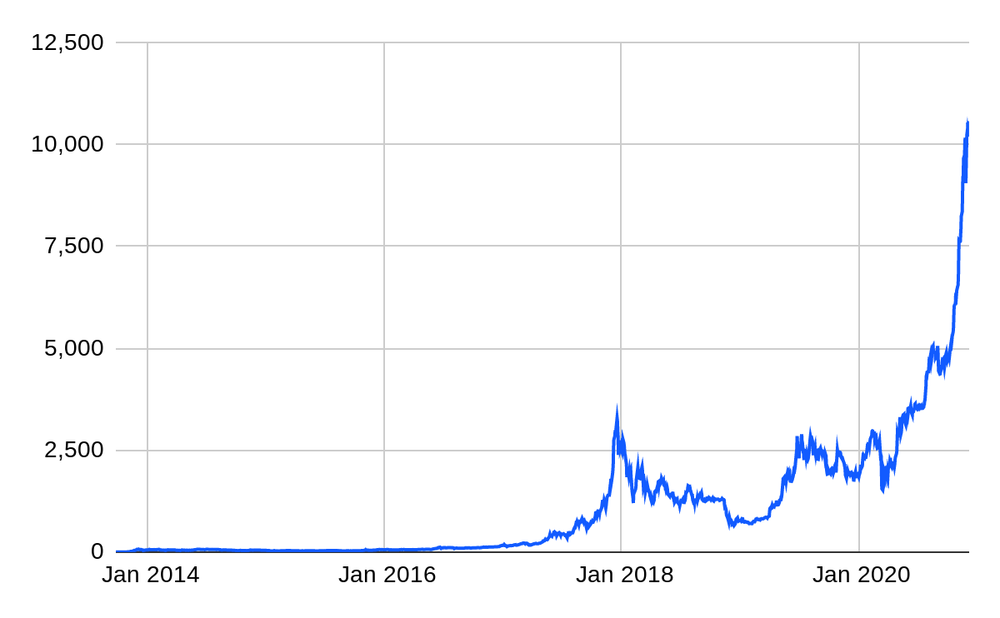
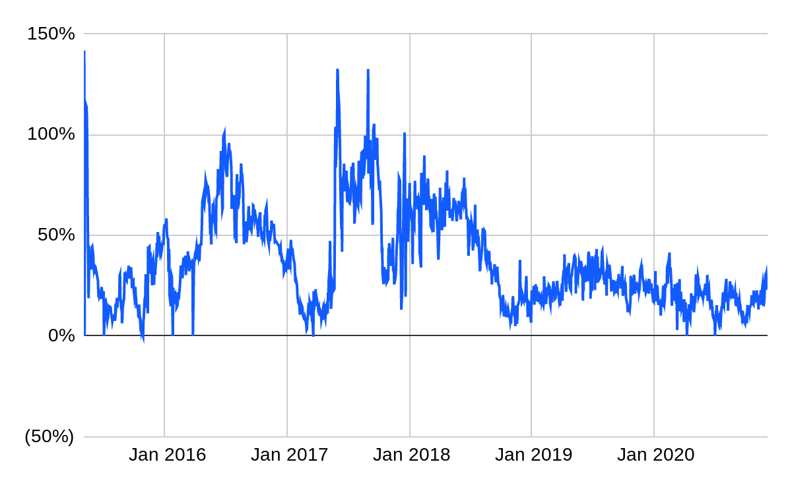

_撰文：BitMEX Research  9 Dec 2020_
_编译：Trendfund Research_

摘要：在本文中，我们探讨了市场上所提供的交易所交易比特币产品。 Grayscale （灰度）是目前明显的领导者，其比特币信托管理超过 55 万枚比特币。我们研究了 Grayscale 产品的数种问题，包括缺乏可赎回性，以及该产品的交易价格与其资产净值存在较大溢价。我们探讨了 VanEck 的新产品，我们认为该产品具有成功所需的一些关键特征。最后我们认为，如果比特币继续保持其强劲的正价格动量，美国主要的 ETF 供应商很可能会推出竞争性的产品，最终可能会取代 Grayscale 的宝座。

### Grayscale （灰度）信托
**
Grayscale （灰度）的比特币信托 [GBTC US] 是迄今在主流证券交易所交易最受欢迎的比特币投资工具。该产品非常成功，截至 2020 年 12 月，其资产规模已增长至超过 105 亿美元，如下图 1 所示。这代表超过 55 万枚比特币，占比特币最终总供应量的 2.6％。

图 1 – Grayscale（灰度）比特币信托 – 总资产（百万美元）

_(来源: 彭博 截至 2020 年 12 月 7 日的数据)_

图 2 – Grayscale 比特币信托 – 对资产净值的溢价

_(来源: 彭博 截至 2020 年 12 月 7 日的数据)_

解释溢价可能是一个挑战，特别是考虑到缺乏赎回机制，人们会认为这对价格不利。理论上而言，投资者在市场上购买该信托是因为当试图在一般经纪账户中取得比特币敞口时选择有限。正是由于缺乏竞争，尤其是在美国市场，才可能因此推高溢价。鉴于管理私钥所面临的挑战，对于大多数投资者而言，购买传统信托比购买真正的比特币容易得多。特别是需要遵守各种法规的机构投资者可能无法直接购买比特币，然而由于比特币的快速升值，他们可能很想要持有比特币敞口，因此，他们会以高额溢价购买该信托。有人可能会问，为什么套利者不能简单地从中获利并缩小价差。合格投资者可以按资产净值创建新的基金单位，然而这个过程可能需要长达六个月的时间。因此，尽管投资者进行了套利并缩小了价差，但显然在大多数情况下，信托仍以大幅溢价交易。

该信托并不保证会永远增加资产。如果投资者对比特币的胃纳减弱，则该信托应会开始以低于其资产净值的折价进行交易。尽管这不会导致该信托立即卖出比特币，但该信托每年收取 2％ 的高额费用，因此信托可能会卖出比特币以支付其管理费。

我们认为，当前情况无法一直持续，而且溢价将因为对比特币的需求减少或来自其他在交易所交易比特币产品竞争加剧而下降。

除了比特币信托，Grayscale 对各种其他加密货币也有类似结构的信托，如下表所示。

| **名称** | **证券代码** | **资产(百万美元)** | **对资产净值的溢价/(折价)** |
| --- | --- | --- | --- |
| Grayscale Bitcoin Trust | GBTC US | 10,569 | 23.0% |
| Grayscale Ethereum Trust | ETHE US | 1,671 | 141.0% |
| Grayscale Ethereum Classic Trust | ETCG US | 75.4 | 46.2% |
| Grayscale Litecoin Trust | LTCN US | 74.4 | 3,197.4% |
| Grayscale Bitcoin Cash Trust | BCHG US | 52.8 | 1,121.1% |

_(来源: 彭博 截至 2020 年 12 月 7 日的数据)_

其他信托对资产净值的溢价甚至比比特币还要高。例如，以太币信托的溢价为 141％。如下图 3 所示，假设我们的计算是正确的，莱特币信托交易对资产净值的溢价超过 3,000%，在 2020 年 11 月下旬达到近 6,000％ 的峰值。我们不清楚为什么有人会支付如此高昂的溢价。同时，交易量也不小，过去六个月的平均日交易量达到近 65 万美元。

图 3 – Grayscale 莱特币信托 – 资产净值溢价

_(来源: 彭博 截至 2020 年 12 月 7 日的数据)_

### 来自其他交易所交易产品的竞争

我们认为，上述数据表明，投资者并没有得到 Grayscale 产品完善的服务。这不一定是 Grayscale 的错 – 他们可能出于法规方面的考量，而在产品结构方面的选择有限。除了 Grayscale 的信托之外，我们还发现了四种可供选择的比特币交易所交易投资工具。

| **名称** | **复制** | **费用** | **主要上市国家** | **资产(百万美元)** | **对资产净值的溢价/(折价)** |
| --- | --- | --- | --- | --- | --- |
| Bitcoin Tracker One (Coinshares) | COINXBE | 2.5% | 瑞典 | 802.5 | (0.3%) |
| Bitcoin Fund (3iQ) (封闭式) | QBTC | 1.95% | 加拿大 | 314.5 | (6.4%) |
| Bitcoin ETP | BTCE | 2.0% | 德国 | 185.7 | (1.1%) |
| 21Shares Bitcoin ETP | ABTC | 1.49% | 瑞士 | 64.9 | 0.2% |
| Vaneck Vectors Bitcoin ETN | VBTC | 2.0% | 德国 | 3.4 | (0.4%) |

_(来源: 彭博 截至 2020 年 12 月 7 日的数据)_

如上表所示，上面的某些产品也存在一些问题。例如，3iQ 比特币基金是封闭式的。

但是，在我们看来，在德国上市的产品中两个较新的，分别于 2020 年 6 月 18 日和 2020 年 11 月 25 日所发行的比特币 ETP 和 VanEck Vectors Bitcoin ETN 是比较强大的产品。这些交易所交易产品是实际复制且开放式的。同时，与 Grayscale 的产品不同，授权参与者既可以创建单位，也可以赎回单位，不会出现任何明显的时间延迟。尽管从总资产来看规模较小，但由于产品结构优越，它们的交易价格非常接近其资产净值。我们认为，这些新的交易所交易产品可能会因此获得可观的市场份额。特别是鉴于 VanEck 作为一家规模 500 亿美元的全球投资管理公司，尽管其目前的比特币资产管理规模仅有 340 万美元，而且年费高达 2％，VanEck 的产品仍有可能在市场上吸引巨大的关注。Grayscale 与之相比，除了其先发优势外，唯一的优势就是在美国上市。

### 结论

尽管 Grayscale 目前的领先优势看起来很强，但鉴于其产品的低效率本质，我们认为当前的市场动态不会长期持续下去。 VanEck 产品是市场上一个非常有趣的新产品，我们认为该产品很可能会获得很大的关注。

如果比特币价格保持强劲，并且现有的交易所交易产品参与者继续从比特币产品中获得丰厚利润，我们认为像 [Blackrock](https://blog.bitmex.com/zh_cn-facebook-takes-on-etf-giant-blackrock-with-a-fixed-income-etf-libra/) 和 Vanguard 这样的行业巨头最终进入游戏是不可避免的。就像 PayPal 最终进入加密货币领域似乎部分是受到 Square 强劲盈利的推动一样，似乎有理由认为 Blackrock 和 Vanguard 可能会被 Grayscale 和潜在的 VanEck 与这些产品相关的强劲盈利报告及其每年 2% 的巨额管理费所吸引而进入。到那时，美国证券交易委员会和美国监管机构可能会愿意批准完整的 ETF，而收费可能会降到其他行业 ETF 的低水平。

虽然 2017 年的加密货币泡沫的特征可以被描述为主要由亚太地区的狂热散户所驱动，但 2020 年的泡沫至少在某种程度上而言越来越像是由美国企业驱动的。如果这种趋势持续下去，由美国主要供应商提供的受监管的比特币 ETF 感觉是一种经济上的必然。到时，确保足够比例的投资者持有自己的私钥可能变得更具挑战性。

免责声明：作为信息平台，本站所发布文章仅代表作者个人观点，与本站立场无关。文章内的信息、意见等均仅供参考，并非作为或被视为实际投资建议。
