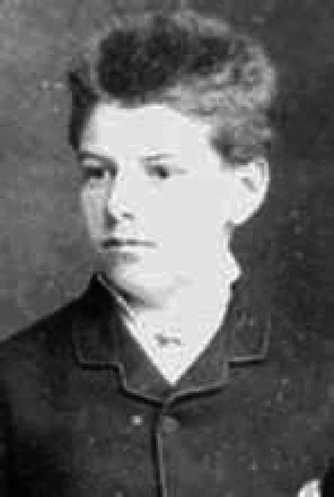
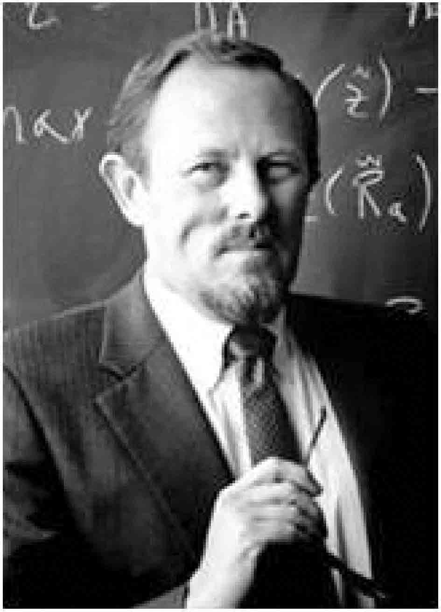
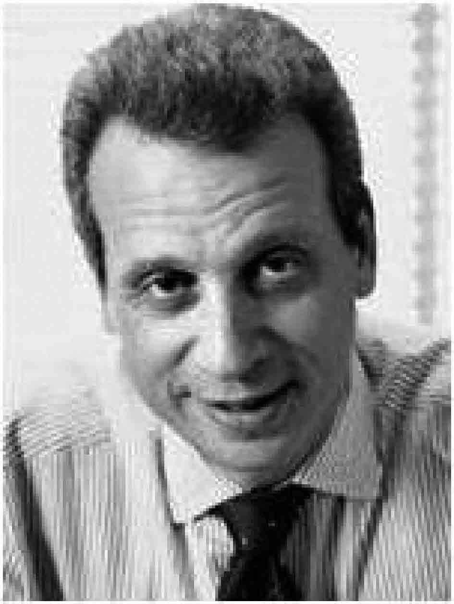
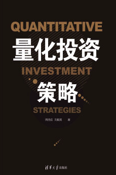

_撰文：周佰成、刘毅男《量化投资策略》_
_编译：Trendfund Research_

走进量化投资，首先就要对量化投资的概念有一个清晰的了解。何为量化投资？简单来讲，量化投资就是依靠数量化的手段去实现投资逻辑和策略；换言之，量化投资需要采用一定的数理模型对投资策略以及投资逻辑进行量化，进而通过计算机技术等现代科技手段来实现投资过程。

每一个优秀的投资者都有其投资逻辑，并且依照其投资逻辑进行投资活动，同时在投资过程中不断修正其原有的投资逻辑。而量化投资的重要核心也是投资逻辑，“量化”是投资者进行投资所应用的一种手段和方式。一个成功的量化投资策略，首先需要有一个明确的投资思想和逻辑，根据这种投资思想和逻辑，通过数量化的手段，把投资所遵从的理念以及逻辑关系等量化为各种变量，以及变量之间的规则，进而构建成相关的量化模型。在此之后，通过计算机技术等手段，将模型应用于市场，在过往的市场数据中进行测试，并不断修正和完善，直到能够将其应用于当前真实市场中选股、买卖、调仓等的判断，并执行交易。

每一个优秀的投资者都有其投资逻辑，并且依照其投资逻辑进行投资活动，同时在投资过程中不断修正其原有的投资逻辑。而量化投资的重要核心也是投资逻辑，“量化”是投资者进行投资所应用的一种手段和方式。一个成功的量化投资策略，首先需要有一个明确的投资思想和逻辑，根据这种投资思想和逻辑，通过数量化的手段，把投资所遵从的理念以及逻辑关系等量化为各种变量，以及变量之间的规则，进而构建成相关的量化模型。在此之后，通过计算机技术等手段，将模型应用于市场，在过往的市场数据中进行测试，并不断修正和完善，直到能够将其应用于当前真实市场中选股、买卖、调仓等的判断，并执行交易。

理解了量化投资这个工具的性质后，容易得知，量化投资首先要有一个合理有效的投资逻辑，这是投资成功的必要条件，进而，还需要工具本身有效，即量化投资的各种量化手段有效，如模型的有效性、数据的准确性等都能够影响到量化投资的效果，除此之外，量化投资中的一些策略对计算机技术的要求也是非常高的，如程序化交易和高频交易。可以说，量化投资是一个系统性的投资过程，因此，一个成功有效的量化投资策略背后均有一个出色的研发和交易团队，成员各司其职，共同实现策略的研发和实践。

## 1. 量化投资的历史沿革
**
1900年，路易斯•巴舍利耶（Louis Bachelier）用量化手段描述了布朗运动。在其发表的论文中，他提出，如果股票遵循随机游走的模式，经过某一段固定时期之后，股票价格到达特定价格水平的可能性可以通过正态分布曲线来描述。巴舍利耶随即构建了价格随时间变化而变化的模型，即为当今重要的随机游走模型。该理论形成了最早的金融市场理论框架，并在此后的现代金融学理论研究中产生了重要的意义。量化投资界也普遍将该理论视为量化投资理论研究的开端。

#### 【1-1】沉睡的理论

_
路易斯•巴舍利耶（Louis Bachelier），1870年生于法国勒阿弗尔。巴舍利耶儿时家庭条件优越，较早接触艺术和数学，并对数学有着极高的天赋，中学毕业后，本应前往名牌大学就读的他由于家庭变故，延缓了上学时间，大学期间，巴舍利耶在证券交易所从事兼职工作，并对金融方面产生了浓厚的兴趣。

1900年，巴舍利耶写出了《投机理论》，但其理论与当时的主流观点背道而驰，并且也被认为不符合数学问题范畴，最终尘封多年。受到论文成绩的影响，巴舍利耶没能成为职业数学家，此后经历了第一次世界大战，辗转于各个高校后，在贝桑松大学拿到了教学职位，直到退休，巴舍利耶都在修正和完善其唯一的论文，没有产生新的成果。

1955年，著名经济学家保罗•萨缪尔森发现了该篇论文，并惊讶地发现该篇论文涵盖了近20年间多个前沿学术成果，而论文的作者巴舍利耶却无人知晓。1964年，保罗•库特勒编撰文集《股票市场的随机性》，并将巴舍利耶的论文收录为第一篇论文。可以说，巴舍利耶领先了一个时代，其理论也不幸沉睡了60余年，被埋没了一个时代！

1952年，哈里•马科维茨（Harry M. Markowitz）在《金融杂志》（Journal of Finance）中发表了题为《组合选择》（Portfolio Selection）的论文，提出了“投资组合理论”，开创性地引入了均值和方差来定量描述投资者在投资组合上获得的收益和承担的风险。该理论被视为现代金融学理论的开端，同时，也被业界普遍认为是对量化投资发展产生重要影响的理论之一，基于此理论，学界开始通过数理方法对微观金融学以及投资学领域进行深入研究。

#### 【1-2】人物介绍：哈里•马科维茨

哈里•马科维茨（Harry M. Markowitz），1927年出生于美国伊利诺伊州。于1950年、1952年在芝加哥大学连续获得了经济学硕士、博士学位。

1952年，马科维茨在《金融杂志》上发表了题为《资产组合选择——投资的有效分散化》论文，开创性地引入了均值和方差来定量描述投资者在投资组合上获得的收益和承担的风险。

马科维茨发展了一个概念明确的、可操作的、能在不确定条件下选择投资组合的理论，该理论被视为现代金融学理论的开端，也是业界比较认同的量化投资理论的开端。

20世纪60年代，威廉•夏普（William F. Sharpe）等进一步发展了哈里•马科维茨的理论方法，并提出了资本资产定价模型（CAPM model），通过CAPM模型确立能反映风险和预期收益的证券价格。在此之后，包括尤金•法玛（Eugene F. Fama）等提出的有效市场假说、三因子模型，以及斯蒂芬•罗斯（Stephen A. Ross）提出的套利定价理论都为量化投资打下了坚实的理论基础。直到今天，上述许多理论及其变型仍然广泛应用于投资实务当中，可以说现代金融理论的发展极大地促进了量化投资的发展。

#### 【1-3】人物介绍：威廉•夏普

威廉•夏普（William F. Sharpe），1934年出生于美国马萨诸塞州，是资本资产定价模型的奠基者。20世纪60年代，夏普将马科维茨的分析方法进一步发展为著名的“资本资产定价模型”，用来说明在金融市场上如何确立反映风险和潜在收益的证券价格。

该模型将马科维茨的资产选择理论中的资产风险进一步分为资产的“系统（市场）风险”和“非系统风险”两部分，并且非系统风险是没有风险补偿的。

由于其在金融经济学方面卓越的贡献，威廉•夏普与莫顿•米勒和哈里•马科维茨共同获得了1990年第十三届诺贝尔经济学奖。

#### 【1-4】人物介绍：斯蒂芬•罗斯

斯蒂芬•罗斯（Stephen A. Ross），出生于1944年，1965年获加州理工学院物理学学士学位，1970年获哈佛大学经济学博士学位。罗斯是当今世界上最具影响力的金融学家之一，因其创立了套利定价理论（arbitrage pricing theory, APT）而举世闻名。2017年3月3日，罗斯先生在康尼狄格州的家中去世，享年73岁。

1976年，罗斯提出了一种新的资产定价模型，即为套利定价理论。该理论用套利概念定义了均衡，不需要市场组合的存在性，而且所需的假设比资本资产定价模型更少，更合理。

#### 【1-5】人物介绍：尤金•法玛

尤金•法玛（Eugene F. Fama），1939年2月14日出生于美国马萨诸塞州波士顿，1964年获得博士学位，著名经济学家，芝加哥经济学派的代表人物之一，芝加哥大学教授。2013年诺贝尔经济学奖得主。

法玛为现代金融学理论的发展作出了诸多重要的贡献。其最主要的贡献便是提出了“有效市场假说”。假说认为在一个有效的证券市场中，价格完全反映了所有可以获得的信息。1992年，法玛基于APT理论，发现股票的市值和账面市值比，可以有效预测未来股票的收益。1993年在一篇论文中，法玛将这两个特征构造为两个风险因子，再结合市场因子，构建了著名的“三因子模型”。

20世纪末，金融工程与行为金融学开始兴起。金融工程对于数学等数理方面的应用，提高了金融实践的效率，促进了金融产品和服务的创新，同时也为量化投资开辟了新的思路。目前优秀的量化投资从业人员大部分都有着金融工程的背景或者有着极强的相关理论的功底；20世纪中后期，“有效市场假说”被广泛接受，成了学术界的主流思想，直到十几年后，研究人员发现股票市场存在着一系列的难以用当前理论解释的问题。这促使金融研究人员对市场的有效性、人的理性问题进行了深入的反思与研究，并得出了一系列的成果，开辟了行为金融学理论，而这为量化投资提供了更多的理论支撑。

此外，20世纪以来，数学理论、计量经济学理论等相关理论的发展也进一步丰富了量化投资的手段与方式，诸如Copula函数等非线性研究成果均被应用到量化投资领域。许多著名的对冲基金公司也高薪聘请学术界的专家人士参与量化策略的研发过程，有些对冲基金公司的创始人自身便是杰出的数学家或者金融学者。同时，近些年来，人工智能、数据挖掘、支持向量机等的发展也为量化投资提供了新的思路和方式，近几年量化投资领域研究的热门也是如何将上述理论方法应用到量化交易策略中，部分方法也取得了良好的效果。

## 2. 量化投资的理解误区

### 2.1 量化投资与基本面分析

基本面分析是许多投资者进行投资决策的重要方法，该种方法主要是通过分析影响和决定证券价格的种种因素，从而得出证券的合理价值，进而确定投资策略。基本面分析主要包括对宏观经济环境基本面的分析、产业层面的分析、公司的基本面分析等。基本面分析主要是一种定性方法，因此，许多读者会认为基本面分析与量化投资策略关系不大。其实恰恰相反，基本面分析也是量化投资策略构建的一个重要组成部分。一个公司的基本面情况对于投资决策具有重要意义，并且，许多基本面分析用到的要素都可以进行量化，通过量化手段设立多个指标，确定相关模型。其实，量化投资策略的开发正是融合了基本面分析与技术分析等多种手段，进而构建模型进行投资决策的。为了方便读者理解，现构建一个基本的基于基本面的量化投资策略。可见策略案例1-6。

基本面分析是许多投资者进行投资决策的重要方法，该种方法主要是通过分析影响和决定证券价格的种种因素，从而得出证券的合理价值，进而确定投资策略。基本面分析主要包括对宏观经济环境基本面的分析、产业层面的分析、公司的基本面分析等。基本面分析主要是一种定性方法，因此，许多读者会认为基本面分析与量化投资策略关系不大。其实恰恰相反，基本面分析也是量化投资策略构建的一个重要组成部分。一个公司的基本面情况对于投资决策具有重要意义，并且，许多基本面分析用到的要素都可以进行量化，通过量化手段设立多个指标，确定相关模型。其实，量化投资策略的开发正是融合了基本面分析与技术分析等多种手段，进而构建模型进行投资决策的。为了方便读者理解，现构建一个基本的基于基本面的量化投资策略。可见策略案例1-6。

### 2.2 量化投资与技术分析

所谓技术分析，是指通过分析证券市场的市场行为，对证券未来的价格变化趋势进行预测的研究行为。其通过对证券市场过去和现在行为的特征，应用数学和逻辑的方法，归纳和总结出证券价格运行的一些典型规律，并据此预测证券市场未来的价格变化趋势。由于技术分析涉及许多数学的内容，以及许多诸如基于K线形态的变化等作出的判断都让人联想到量化投资，因此也有许多人将量化投资和技术分析等同对待，那么量化投资是否与技术分析相同呢？

从严格意义上来讲，量化投资与技术分析是不同的。二者之间的关系和区别主要有以下三个方面。

#### 1复杂与简单之分
传统上或者称为狭义上的技术分析主要包括MACD（指数平滑移动平均线）、均线等技术指标，对我国股票投资领域而言，传统的技术指标散户使用居多，并且指标开发、选取以及修改主要根据各看盘软件提供的指标和平台进行，因而可修改内容有限。与此同时，许多非专业投资者对于技术分析的研究不够深入，从而导致了在投资领域的一个显而易见的情况便是技术分析普遍较为简单，并且有效性较为一般，故技术分析由于门槛较低，获得超额收益较难。反观量化投资策略，其主要使用主体为专业的机构投资者，该类人员对于数学、计算机以及金融学等方面有着深厚的理论功底，并且依托于自身开发的平台，能够实现复杂技术的运用，因而运用到的理论和技术相比传统的技术分析与技术指标而言普遍更加复杂。由于门槛较高，并且业内存在的严重的信息不对称性，会使真正开发出优秀量化策略的团队能够获得较为可观的超额收益。当然，随着技术分析的发展并且与量化策略的融合，简单与复杂并不是绝对的，并且很多的量化策略也是建立在传统的技术分析的基础上进行开发完善的。

#### 2．量化投资策略包含但不限于技术分析
正如上段所言，目前许多的量化投资策略都能见到技术分析的身影，可以说，传统的技术分析手段是量化投资策略构建的一个重要部分，技术分析主要追踪的是资产的走势，以及通过量价关系等确定投资行为，这与量化投资策略并不矛盾。许多基于趋势的量化投资策略也包含了相关的技术分析内容，如当某只股票上穿10日均线时买入，下穿10日均线时卖出，这便是一个简单的技术分析策略，但是同样也可以应用到量化投资策略中。当然，实际的策略要比该策略复杂得多。然而，量化策略除了应用技术分析指标之外，还有许多其他的手段，如机器学习、传统的财务指标等都可以作为选股或者择时的手段。因此，量化策略包括并发展了传统的技术分析手段，但是又要比传统的技术分析手段更加丰富。

#### 3．传统的技术分析相比于量化投资主观性更强
传统的技术分析的技术指标虽然涉及许多临界值等数据，但是仍有许多判断方法是基于投资者主观决定的。例如，许多技术分析投资者经常根据一个指标图形形态的好坏判定市场的情况或者买卖点位，但是形态的好与坏较为主观，不同人进行判断也会出现一定的偏差。再如，著名的艾瑞特波浪理论，“数浪问题”在不同投资者眼中也会得到完全不同的结果，如果技术指标的判断方式没有明确的数量规则，那么主观性就会产生。而量化策略的买入、卖出、调仓等行为均是通过模型构建得出的结果，不包含任何主观因素。在量化投资中如果想要应用技术指标，就要确保指标可以完全量化。

### 2.3 量化投资与事件投资

股票市场尤其是A股市场充斥着许多事件性的投资机会，诸如定向增发、并购事件、公司重要信息披露等都会使市场上出现较好的投资机会。从表面上来看，事件投资与量化投资应该是完全不同的投资行为，并且量化投资由于其数量化手段的局限性并不能很好地捕捉事件投资机会。其实，许多事件都是可以量化的，许多数据库也提供了事件的内容，如定增事件投资便可以被量化。可以说，如果某一个事件能够被量化，那么就可以尝试构建事件驱动型量化策略。关于事件驱动的量化策略的具体内容可参见本书对于事件驱动策略介绍的章节。

### 2.4 量化投资策略复杂程度与有效性

由于量化投资策略往往涉及许多数学和计量经济学等复杂理论，因此量化投资总是让外界觉得高端，难以入门，同时量化投资普遍被认为有着复杂难懂的模型。其实，如金融学理论发展所展现的一样，量化投资策略在初期是比较简单的，然而随着相关理论知识的发展，以及过去的模型由于简单易懂而被市场参与者更多地使用，从而导致超额收益的减少，才驱动了量化投资策略的复杂化。虽然量化投资策略日渐复杂，并且结合的知识领域也越发丰富，但是这并不代表复杂的策略就一定有好的效果，获得更高的超额收益。这与技术分析的特点相似，一个技术指标并不在于多复杂，相比来讲，更在于不为人知。因此在量化投资领域，未必策略用了复杂的公式模型就会获得更高的收益，更高的收益在于策略的独特性以及其内在的出色的投资逻辑。

### 2.5 量化交易与高频交易

高频交易意味着每次交易从开仓到平仓只有很短的时间间隔，一般从十几分钟到几微秒不等，主要目的是通过市场短暂的价格波动而获利。高频交易的交易执行者通过计算机下单、将策略执行部件放置于距离交易所主机更近的地理位置上、交易订单直通交易所等手段，从时间延迟等层面减少了价格变动带来的交易成本，从而增加套利空间，目前高频交易技术已经进入微秒级别的领域。许多时候，相关人士习惯将高频交易与量化投资混为一谈，其实二者并不完全相同。二者的区别主要有以下几点：第一，高频交易是量化投资的一个分支，只要量化投资策略中开仓到平仓的时间间隔足够短，都可以称为高频交易，但是除此之外，量化投资根据交易频率还可以划分为中频交易和低频交易。而本书主要讨论的量化交易策略为中低频交易策略。第二，高频交易与大部分量化投资策略的关注点不同，高频交易相比于中低频的量化交易策略更加注重硬件保障和降低时间延迟等相关问题，因此，量化投资公司和高频交易公司便存在很大的差异。量化投资公司通常由量化背景强的人创建，而高频交易更多的是由传统交易员创办。第三，量化投资一般依赖于复杂的模型，而高频交易更多地依赖于运行高效的代码。值得一提的是，高频交易在我国还属于新兴行业，高频交易公司或者部门仍旧比较少，并且受到政策和技术等多方面的限制。目前我国高频交易主要集中在期货市场，随着期货种类的丰富和股指期权等多种金融工具的推出，我国高频交易将会取得一定程度的发展。

### 2.6 量化交易与程序化交易

程序化交易是指通过既定程序或特定软件，自动生成或执行交易指令的交易行为。随着金融衍生品的不断丰富，程序化交易成了机构投资者的一个重要的交易实现手段，解决了机构迫切需求的批量下单、全市场不间断交易、减少冲击成本等问题。这种技术手段，用软件下单代替了人工委托。许多时候，量化交易与程序化交易是相同的，但是，如前文所述，量化投资的核心是将投资理念和逻辑数量化，但是并不一定要求自动化买卖下单，尤其是在一个市场还不健全的时候，程序化交易会受到监管部门的限制。但是这对于量化投资发展的影响却是有限的，通过量化交易策略模型获得待选股票，确定买卖点之后的交易行为完全可以通过手动实现。当然，在市场完善的情况下，通过程序化交易能够大幅度提升量化投资的效率，有利于量化投资策略的研发。然而，近几年来，程序化交易不断出现各样的错误操作，这是程序化交易需要严格避免的问题。

......

[在线阅读原著](https://cread.jd.com/read/startRead.action?bookId=30538499&readType=1)

免责声明：作为信息平台，本站所发布文章仅代表作者个人观点，与本站立场无关。文章内的信息、意见等均仅供参考，并非作为或被视为实际投资建议。
