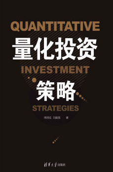

_撰文：周佰成、刘毅男《量化投资策略》_
_编译：Trendfund Research_

### 1. 客观的历史评估手段
客观的历史评估手段是指当我们构建了一个量化策略时，可以通过回溯测试的方式对策略在历史市场数据的效果进行一个客观的判断。回测过程会提供收益率、最大回撤以及夏普比率等指标，可以通过回测过程对策略的效果得出一个客观有效的策略评估结果，并且通过该过程可以选择出在未来可能会获得较高的超额收益的投资策略。而主观投资者回顾市场和检验策略的方式都容易加入自身的主观判断，由于每个人的性格、经验等不同，这种主观的判断方式势必会导致检验效果的不稳定和不够精确，但量化投资可以在一定程度上规避这样一个缺点。

### 2. 克服人性弱点
量化投资包含一个完整的交易过程，交易信号都是通过投资者构建的模型给出的，并且在程序化交易形式下，交易行为也都是通过计算机自动执行的，投资者的主要作用是将个人的投资逻辑数量化。而主观投资一个重要的问题就是如何克服人性的缺点，而这个问题在量化投资中可以得到一定的规避。投资者的情绪和个性对于投资行为有着重要的影响，如冲动的情绪很可能导致不理性的投资决策，但量化投资策略将投资过程数量化、自动化，可以帮助减少情绪和个性上的影响。

量化投资包含一个完整的交易过程，交易信号都是通过投资者构建的模型给出的，并且在程序化交易形式下，交易行为也都是通过计算机自动执行的，投资者的主要作用是将个人的投资逻辑数量化。而主观投资一个重要的问题就是如何克服人性的缺点，而这个问题在量化投资中可以得到一定的规避。投资者的情绪和个性对于投资行为有着重要的影响，如冲动的情绪很可能导致不理性的投资决策，但量化投资策略将投资过程数量化、自动化，可以帮助减少情绪和个性上的影响。

但是，量化投资也并不能够完全规避人性的弱点。量化投资研发与交易过程中也会受到情绪等主观因素的影响。例如，当应用量化投资策略的基金经理在一段时间遭遇了策略的较大回撤时，面对客户以及上级的压力，基金经理是否还能够坚持自身的策略或者对于策略作出一个理性的判断，这都会考验基金经理的综合能力。此外，许多中低频的量化投资策略主要通过计算机和数学技术选择股票，确定买卖点位等，但是交易行为是通过交易者手动执行的。因此，交易者在执行量化策略之前是否对自己的策略有足够的信心，是否会受到环境因素的影响，都是需要考虑的问题。总的来说，量化投资能够大大地降低投资的主观行为，在一定程度上克服人性的弱点，但并不是可以完全规避的。

### 3. 更高的效率
由于量化投资策略应用了计算机技术，所以相比主观投资方式来讲，能大幅度地提高投资行为的效率。例如，在程序化交易过程中，交易无须人员盯盘以及手动执行买卖行为。基于该种特点，量化投资的研究人员就能够将更多的时间应用于策略的完善和开发上。此外，随着市场容量的不断扩大，数据量的不断增加，处理数据和监控市场更加需要借助计算机技术的帮助，从而提高投资的效率。

### 4. 更加出色的风险管理能力
一个完整的量化投资策略的主要组成部分便是风险管理和仓位管理的过程，一个有效稳定的量化投资策略会动态地进行风险管理，调整仓位和杠杆等风险因素，随着市场环境的变化不断进行适应。然而，虽然主观投资也有着风险管理和仓位管理等要求，但是其调整方式不如量化投资策略灵活，对于风险的估计和监控也不如量化投资出色。因此，相比主观投资而言，量化投资有着更加出色的风险管理能力。

一个完整的量化投资策略的主要组成部分便是风险管理和仓位管理的过程，一个有效稳定的量化投资策略会动态地进行风险管理，调整仓位和杠杆等风险因素，随着市场环境的变化不断进行适应。然而，虽然主观投资也有着风险管理和仓位管理等要求，但是其调整方式不如量化投资策略灵活，对于风险的估计和监控也不如量化投资出色。因此，相比主观投资而言，量化投资有着更加出色的风险管理能力。

### 5. 可移植性
许多量化策略的内在投资逻辑适用于多个资产或者市场，而由于量化投资策略自动化程度较高，因此对于策略稍加改动便较为容易应用到其他资产或者市场当中，有着较强的被移植能力。例如，一些应用于商品期货市场的趋势型投资策略，假若其使用的因子与股票市场有共通性，那么在商品期货市场试验有效之后，便可以移植到股票市场进行验证。同时，若一个策略在几个市场均有效，那么对于那些进行多市场资产配置的投资者而言，量化投资明显地降低了策略的研发成本。

### 6. 发展完善能力强
如前文所述，量化投资的发展与金融学理论、数学、计量经济学和计算机技术等的发展息息相关，世界有关领域的学者都在不断研究更新的理论与实践内容，这其中的很多研究成果都对量化投资有着重要的借鉴意义。并且，随着这些理论的发展，理论与实践能力俱佳的量化投资团队便会完善相关研究成果，将其转化为可获得利益的投资策略。同时随着计算机技术的发展，许多新的想法都可以通过程序来实现，这便能够大大促进量化投资策略的进一步发展和完善，这也是量化投资策略日渐复杂的一个重要原因。

### 7. 减少对个别人员的依赖
一个完整的量化策略构建流程需要一个团队共同付出努力，经过不断调试、完善才能够获得一个有着良好效果的策略。这个流程的显著特点便是对于个人的依赖性减少，个别人员的离职对于公司的冲击降低。而反观做主观投资的基金经理，一名优秀的基金经理的离职对于原公司的影响非常大，会带来大量的客户流失，旗下基金的收益能力也会大打折扣，而不得不说的是目前我国基金经理的跳槽也十分常见。而量化基金只要策略仍旧属于公司，那么基金经理的离职对公司的冲击将会大大降低。当然，即使如此，企业也应通过更好的激励方式留住优秀人才。

一个完整的量化策略构建流程需要一个团队共同付出努力，经过不断调试、完善才能够获得一个有着良好效果的策略。这个流程的显著特点便是对于个人的依赖性减少，个别人员的离职对于公司的冲击降低。而反观做主观投资的基金经理，一名优秀的基金经理的离职对于原公司的影响非常大，会带来大量的客户流失，旗下基金的收益能力也会大打折扣，而不得不说的是目前我国基金经理的跳槽也十分常见。而量化基金只要策略仍旧属于公司，那么基金经理的离职对公司的冲击将会大大降低。当然，即使如此，企业也应通过更好的激励方式留住优秀人才。

#### 策略案例——简单基本面选股策略

一、策略思想
为方便读者了解基本面选股方法如何运用在量化投资中，现构建一个基本面选股策略，为方便理解，策略构建条件比较简单，与现实情况有一定差距。即策略要选取公司利润情况和经营情况都比较好的股票，现特意选取两个财务指标，分别为营业利润率和净资产收益率（ROE），以此构建量化选股策略。

二、策略构建
（1）股票池：全部A股。
（2）策略思路：提取营业利润率和净资产收益率均大于10%的股票，并选择其中五只构建投资组合。
（3）止损与止盈：个股盈利超过20%止盈，亏损超过20%止损。
（4）最大建仓数量：5只。
（5）起始资金：10万元。
（6）回测区间：2016年6月1日—2016年12月1日。
（7）比较基准：沪深300指数。

三、回测情况

由此可见，基本面分析方法是可以应用到量化投资中的，并且由上述回测结果可以看出，在选定时间段内，利用营业利润率和净资产收益率选择的股票都有着较好的收益，策略收益高于作为比较基准的沪深300指数收益。当然，若想将策略应用到实际投资中，还需要不断进行完善。

### 行业人物：詹姆斯•西蒙斯

詹姆斯•西蒙斯（James Simons），1958年毕业于麻省理工学院数学系，1961年获得加州大学伯克利分校数学博士学位。美国著名数学家、投资家和慈善家。作为最伟大的对冲基金经理之一，他是量化投资的传奇人物。

1976年，西蒙斯摘得数学界的皇冠——全美维布伦（Veblen）奖，其个人数学事业的成就也就此达到顶峰。之后，西蒙斯转入金融界，于1978年开设了私人投资基金Limroy，1982年，在美国纽约成立了文艺复兴科技公司（Renaissance Technologies LLC），文艺复兴科技公司是世界最成功地利用量化交易的对冲基金管理公司。他们利用强大的计算机和数学能力来开发与执行投资策略。5年后创立文艺复兴科技公司，并推出公司旗舰产品——大奖章Medallion基金。大奖章基金以其出色的业绩闻名投资界。

......

[在线阅读原著](https://cread.jd.com/read/startRead.action?bookId=30538499&readType=1)

免责声明：作为信息平台，本站所发布文章仅代表作者个人观点，与本站立场无关。文章内的信息、意见等均仅供参考，并非作为或被视为实际投资建议。
