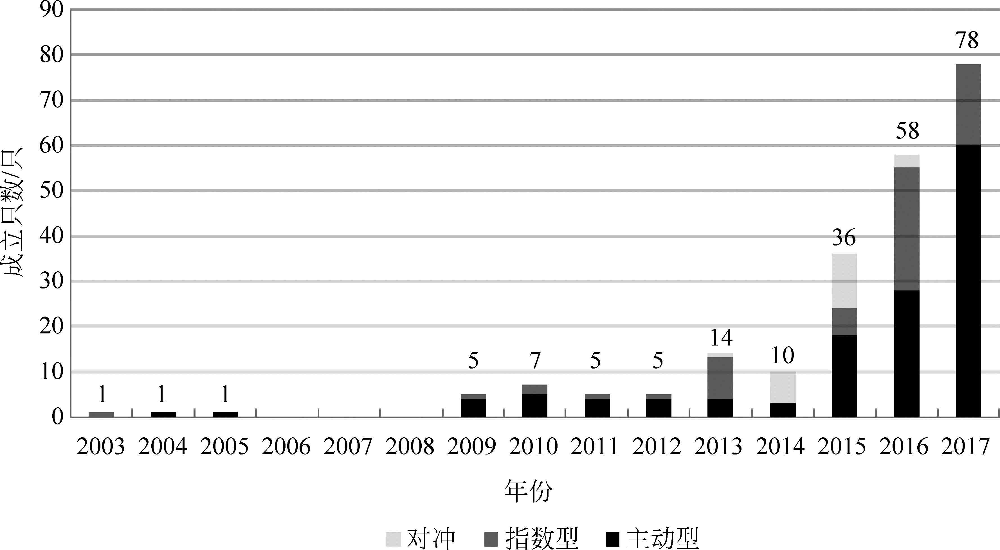
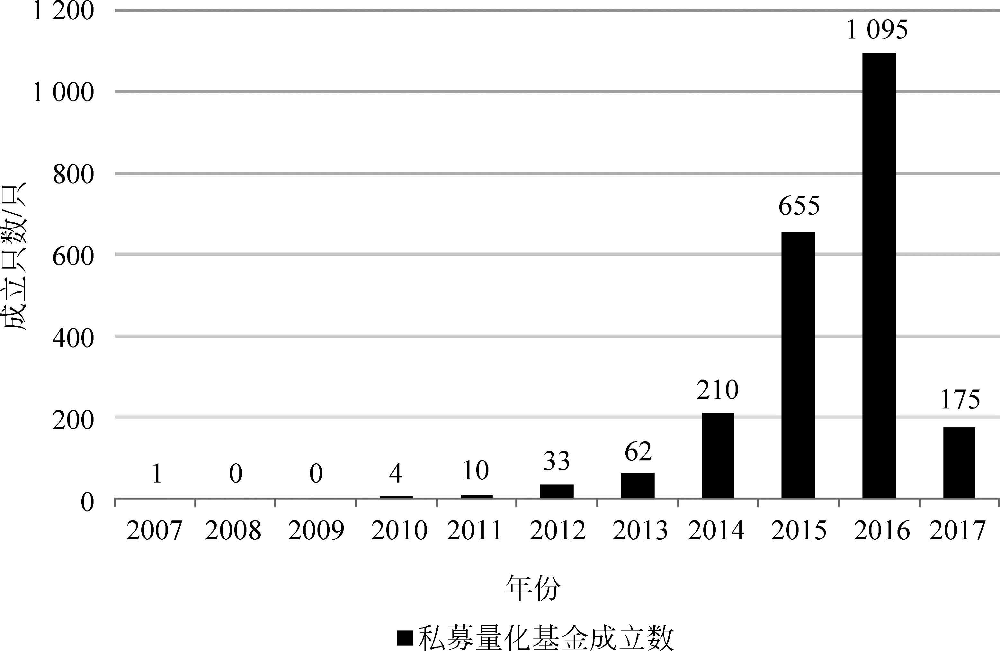
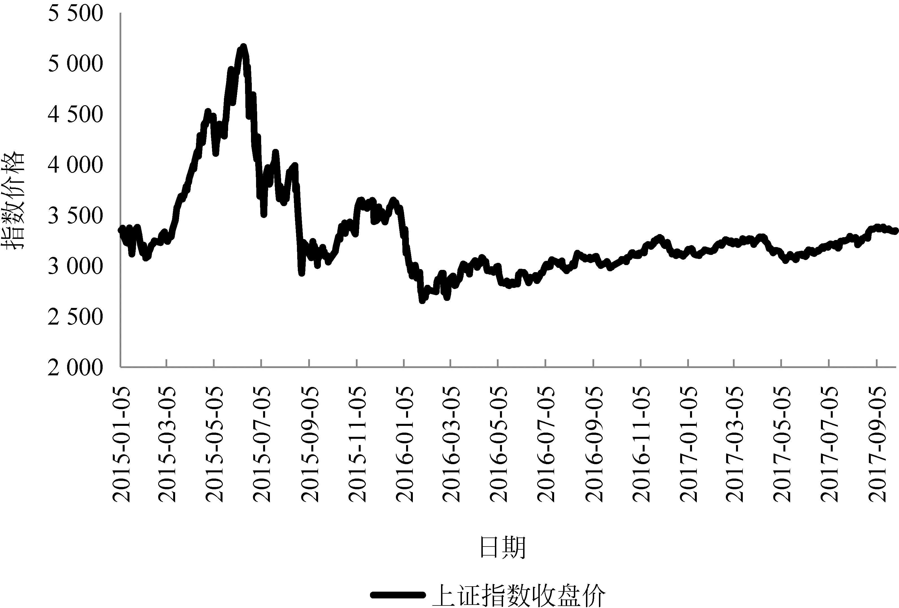
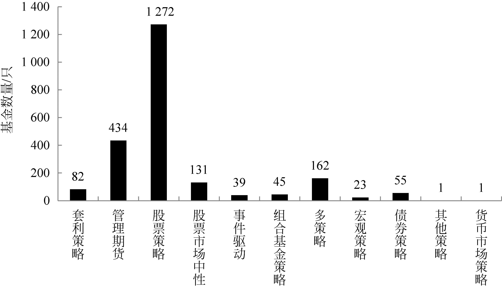
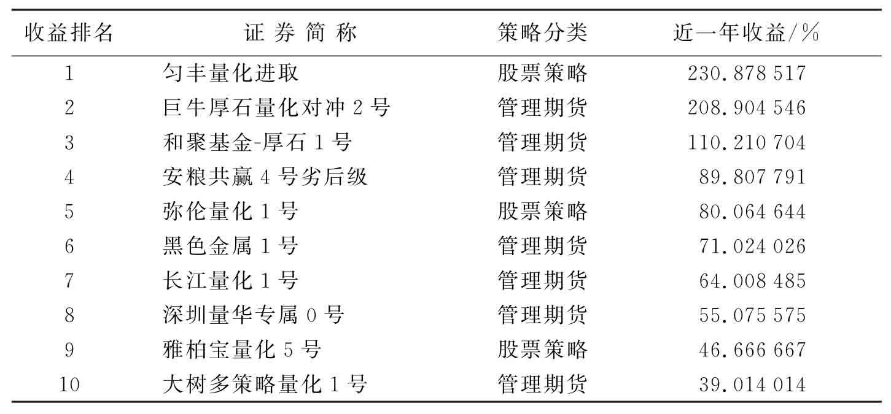
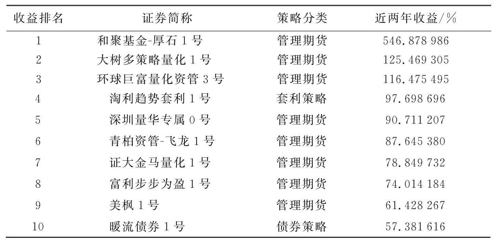
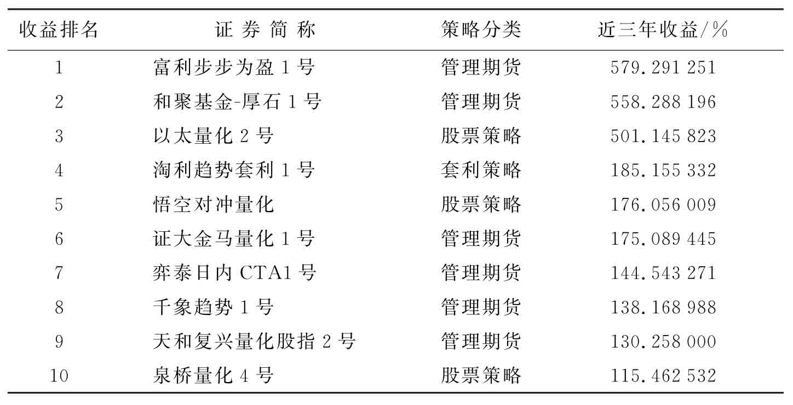
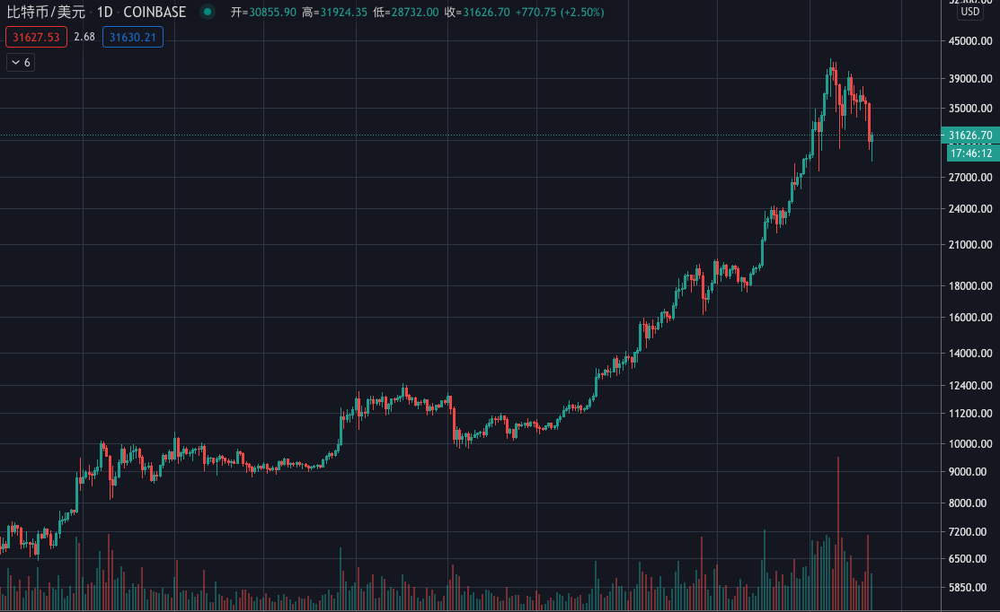
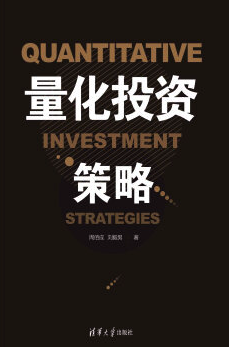

_撰文：周佰成、刘毅男《量化投资策略》_
_编译：Trendfund Research_

量化投资在我国出现较晚，距今只有十多年的历史。2004年8月，我国第一只公募量化基金“光大保德信量化核心证券投资基金”成立。2005年，“上投摩根阿尔法股票型证券投资基金”也随之问世。但是，量化基金上市之初并未引起基金投资者的关注，直到2010年股指期货推出之后，量化投资开始逐渐涌现，并在2015年和2016年快速发展。下面将分别阐述我国公募量化基金和私募量化基金的发展情况。

### 公募量化基金的发展

根据Wind金融终端数据显示，截至2017年9月30日，市场共有221只量化型公募基金，基金规模总计达1 110亿元，其中主动型量化基金规模为813亿元；指数型基金252亿元；对冲型基金45亿元。如图1-1所示，在2003—2008年我国公募量化基金并未出现明显的发展，2008年金融危机过后，基于国外量化基金市场的成功经验，我国公募基金开始积极发行量化型基金。并且，随着2010年我国推出股指期货后，量化对冲型基金也开始逐渐出现，直到2014年年末，我国共发行了公募量化基金49只，其中有主动型基金26只，指数型基金15只，对冲型8只。2015年开始，随着我国股票市场出现的大幅上涨行情，国内投资者投资热情高涨的同时也促进了基金的发行，2015年一年便发行了量化公募基金36只，其中主动型18只，指数型6只，对冲型12只。此后我国为防止发生系统性金融风险，采取了限制股指期货做空的措施，这也导致了量化对冲基金的数量的减少，2016年，公募量化基金发行数达到了58只，其中主动型为28只，指数型27只，对冲型仅发行了3只。但是量化对冲基金由于其稳健的收益和较小的回撤在市场不稳定时期更加受到投资者的青睐。2017年，我国量化基金的发展势头仍旧较好，截至2017年9月30日，共发行了78只公募量化基金，其中有60只为主动型基金，指数型18只。从图1-1中可以看出，主动型公募量化基金在2016年和2017年都出现了较好的发展势头，也证明了量化投资在我国逐渐被认可。

图1-1　2003年1月1日—2017年9月30日公募量化基金成立数
资料来源：Wind金融终端

从收益方面来看，根据Wind资讯的数据，目前成立超过5年的公募量化基金共有24只，近5年回报最高的达到了249%，回报最低的为47%，24只基金近5年平均收益为134%，平均最大回撤为16.41%。同期沪深300指数收益为67.31%，上证指数收益为60.53%。以沪深300指数为基准，超额收益为正的基金有22只，平均超额收益达到了73.69%。从长期来看，量化基金收益可观，非常有竞争力，并且回撤较小，收益更加稳定。2017年前三个季度，我国公募量化基金市场收益分化比较严重，221只基金中，获得正收益的有169只，平均收益为8.48%，在此期间的平均最大回撤为7.10%，收益最高的基金为57.91%。在此期间，沪深300指数收益为15.90%，上证指数收益为7.90%。结合基准收益（沪深300指数）来看，超额收益为正的基金仅有30只，如果以上证指数为基准，超额收益为正的基金有90只。2017年我国股市的大盘股表现要明显好于中小盘股，而量化基金普遍更加乐于配置中小盘股，因此也导致了该年量化基金收益的分化。

### 私募量化基金的发展

根据Wind金融终端数据显示，截至2017年9月30日，市场共有2 245只量化型私募基金，如图1-2所示，2010年之前我国推出私募量化基金的公司寥寥无几，2011—2013年，不断有私募基金公司推出量化投资类型的基金，三年间共推出了105只基金。2014年开始，我国量化私募基金开始快速发展，2014年新推出的基金数超过了2013的3倍。2015年和2016年发展更加迅速，2015年新推出的私募量化基金数为655只，2016年则是达到了1 095只。可以说2015年和2016年是私募量化基金发展的爆发增长期，其主要原因是受到这两年股票市场的影响，如图1-3所示，在2015—2016年两年间，我国股市出现了大幅波动，由于量化投资基金更加完善的风险控制体系、投资的高度分散性和纪律性，在此期间量化投资基金能够带来更多的超额收益，因此也促进了私募量化基金的发展。到了2017年，由于市场风格不断变化与波动等原因，私募量化基金的收益普遍出现了下滑，非量化基金普遍能够获得更高的超额收益。因此，截至2017年三季度末，仅推出了175只私募量化基金。

图1-2　2007—2017年私募量化基金成立数，数据截至2017年9月30日。
资料来源：Wind金融终端

图1-3　上证综指2015—2017年走势
资料来源：Wind金融终端

图1-4所示为截至2017年9月30日，不同策略的私募量化基金数量，相比早期仅推出股票策略的基金而言，如今的策略丰富度越来越高。但是大部分的私募量化基金策略依旧是股票策略。此外，随着我国期货市场的发展，近几年来，管理期货（CTA）类型的私募量化基金数量不断增多，策略种类占比接近20%。

图1-4　不同策略私募量化基金数量
资料来源：Wind金融终端

从收益方面来看，根据Wind资讯的数据，目前成立超过5年的私募量化基金共有39只，近5年回报最高的达到了351.26%，回报最低的为－45%，39只基金近5年平均收益为73.58%，平均最大回撤为10%。同期沪深300指数收益为67.31%，上证指数收益为60.53%。以沪深300指数为基准，超额收益为正的基金有14只，平均超额收益达到了88.18%。从长期来看，私募量化基金收益虽然总体上不如公募量化基金，但是收益也比较可观，回撤较小。2017年前三个季度，在可统计的837只私募量化基金中，获得正收益的有428只，平均收益为1.56%，在此期间的平均最大回撤为6.04%，收益最高的基金为86.15%。在此期间，沪深300指数收益为15.90%，上证指数收益为7.90%。结合基准收益（沪深300指数）来看，超额收益为正的基金仅有45只，如果以上证指数为基准，超额收益为正的基金则有155只。2017年前三个季度虽然我国量化基金收益都存在一定的分化与下滑，但是私募量化基金的表现要略优于公募基金，其中一个原因是CTA策略在私募量化基金中的盛行，并获得了不错的收益。

**近一年收益率排在前十位的私募量化基金中，CTA策略占了7名，股票策略占了3名。近两年收益率排在前十位的私募量化基金中，CTA策略占了8名，套利策略和债券策略各占1名。近3年收益率排在前十位的私募量化基金中，CTA策略占了6名，如表1-1~表1-3所示。期货市场由于其杠杆性，以及CTA策略对于趋势的把控，从而使在我国CTA策略普遍能够获得较好的收益，因此从这几年量化投资在我国的发展来看，CTA的发展更为迅速。**
**
#### 表1-1　私募量化基金近一年收益前十名

资料来源：Wind金融终端

#### 表1-2　私募量化基金近两年收益前十名

#### 表1-3　私募量化基金近三年收益前十名

资料来源：Wind金融终端

### 什么是CTA（管理期货）？

金融领域的产物普遍存在着「历史原本定义」与「当代现实定义」偏离的现象，CTA 策略的定义也随着时代的发展而有所转变。

CTA 最开始指的是「商品交易顾问（Commodity Trading Advisor）」的英文首字母缩写，但由于交易的标的——商品期货类相比股票类的投资风格有很大不同，往往需要研判其短期走势，因此技术面所占权重远大于基本面，直至可以脱离基本面，以纯技术面只对价格进行分析。

就技术分析的角度来看，经历了这样一个历程：早期通过手动绘图来计算交易信号，电脑普及以后这个工作就交给电脑来做，人们只负责把电脑的运算结果运用于策略，到后来连策略本身也可以系统化为代码完全交由电脑执行，这就演变为程序化交易。

鉴于程序化的代码很难和基本面有什么有效交集，故而现代 CTA 策略的核心特征可以总结为以下三点：

- 一切基本面的结果都已经包含在价格里
- 价格走势并非完全随机
- 价格的某些运行形态总以趋势的面貌重演

下面针对三点核心特征背后的逻辑进行深入分析：

#### 1. 一切基本面的结果都已经包含在价格里

这是 CTA 策略的基本世界观，不论基本面如何错综复杂、变幻无常，价格都是所有基本面博弈后的最终产物。

根据佛学的说法，任何一种事物都有三个参数——体、相、用。例如玻璃杯：玻璃为「本体」，杯型为「相状」，装水为「作用」。

对于市场来说：价格是体，基本面和技术面是相，交易行为是用。

如果把价格这个本体比喻成手，基本面和技术面的相状就相当于手心和手背，作用于交易就相当于打架，拳头打用的是手背，掌击用的是手心，当然也不妨拳掌并用。

不过需要强调的是并不存在基本面和技术面都分析一下就更加保险的效果，那只是缺乏安全感的人性的自我安慰，实际上「100% 技术面」与「100% 基本面」与「x% 技术面 + y% 基本面（x + y = 100）」无非是分布权重的区别，与策略本身的好坏无关。

例如著名的 Medallion 基金在成立之初走的是基本面与技术面结合的路线，但运行不久亏损了 30%，创始人 James Harris Simons 与另一位数学教授对模型进行整改，最终决定剔除一切关于基本面的东西，只对技术数据进行分析，从此 Medallion 基金成长为年化收益率与累计回报率世界第一的基金。

由此证明只基于价格分析完全是可以独立成立的。

基本面与技术面在形式上可以独立存在，也可以结合使用。两者从不同的角度去诠释同一个东西，最终的结果取决于认知的深度而非角度。

#### 2. 价格走势并非完全随机

有个朋友做过一个实验，他有多种可以盈利的交易方法，随后写了个随机函数来虚拟价格，在随机生成的价格下，他的任何策略都失效了，但只要把策略应用回现实价格中，又能继续盈利。由此他得出个结论：价格绝对不是完全随机的，是有迹可循的。

或者换个更精确的说法，价格的发展虽有一定的随机性，但至少绝大多数时间是连续的，即：前一根 K 线的收盘价几乎等于后一根 K 线的开盘价。

如图，在市场中经常可见这种趋势形态，它的未来发展态势虽充满不确定性，但它的价格是非常平滑的，非离散的，只要识别（或试错）出它的启动时机，就可以实现趋势跟踪策略，就算没有走出趋势，至少平滑的价格给了交易者足够止损的余地。价格虽然有「随机」成分，但 CTA 策略可以「随机而动」。

#### 3. 价格的某些运行形态总以趋势的面貌重演

不妨放松一下，先来看最近流行的一个段子：

现在有一个很大的误区就是：办公室的白领们自以为表现优于父母。其实这不过是因为经济结构转型造成的误会而已。
现在在公司的格子间里面哼唧哼唧做 PPT 的那些人，和当年踩着缝纫机的女工们，其实没有本质的区别；
同理，父母当年在菜场讨价还价一分两分和现在抢红包很起劲的差不多；
父母当年非要给遥控器套个塑料袋跟现在手机非得戴个套也差不多；
现在每天刷微博刷朋友圈的人跟当年蹲墙根晒太阳嗑瓜子的也没什么区别。
......

虽是段子，不失为真理啊！外在的表象会与时俱进，但内在本质却从未变化。

相似的例子不胜枚举：

每次股灾过后，新韭菜依然会蜂拥而至为下一次暴跌添砖加瓦。
庞氏骗局层出不穷，不会因为一拨人受骗而下一拨人就能够幸免。
外汇行业的诈骗公司每年换个名字，打一枪换一个地方，仿佛傻子太多骗子不够用。
……

我们会发现，宏观来看，人类永远不会长记性，历史总在重演，无关褒贬，这就是真实的人性写照。

交易市场是由所有参与者的预期与行为推动的，因此成为了人性的载体，作为同一物种，任何时代的人类都会重复骨子里的想法和行为，因此任何与人有关的事物都会产生自相关性，这致使了市场中的某些形态总会重复出现，从本质上，K 线图就是赤裸裸的人性的曲线。

市场中流传着同样观点的名言：

「口袋变了，股票变了，华尔街却从来没变，因为人性没变。华尔街没有新生事物，投机像山岳一样古老。」—— 华尔街投机之王 Jesse Lauriston Livermore
「1980 年代使用的交易策略，与现在并没太大改变。」—— CTA 教父 Martin Lueck
「所有人都知道的策略不一定就不好用，投资者的 behaviour 行为属于人之本性，不因时代和投资者教育而改变。」—— 来自一家排名全球前三大量化对冲基金的启示
即便是蜡烛图的发明者——十八世纪的本间宗久总结的各种 K 线形态至今仍被广泛使用着。

总结来说：人性永不变，历史自相关，投映各行业。

综上三点，CTA 策略背后的深层逻辑全部应归结于事理思想层面，而非 PNL损益、Momentum 动量等数理工具层面。

......

[在线阅读原著](https://cread.jd.com/read/startRead.action?bookId=30538499&readType=1)

免责声明：作为信息平台，本站所发布文章仅代表作者个人观点，与本站立场无关。文章内的信息、意见等均仅供参考，并非作为或被视为实际投资建议。
